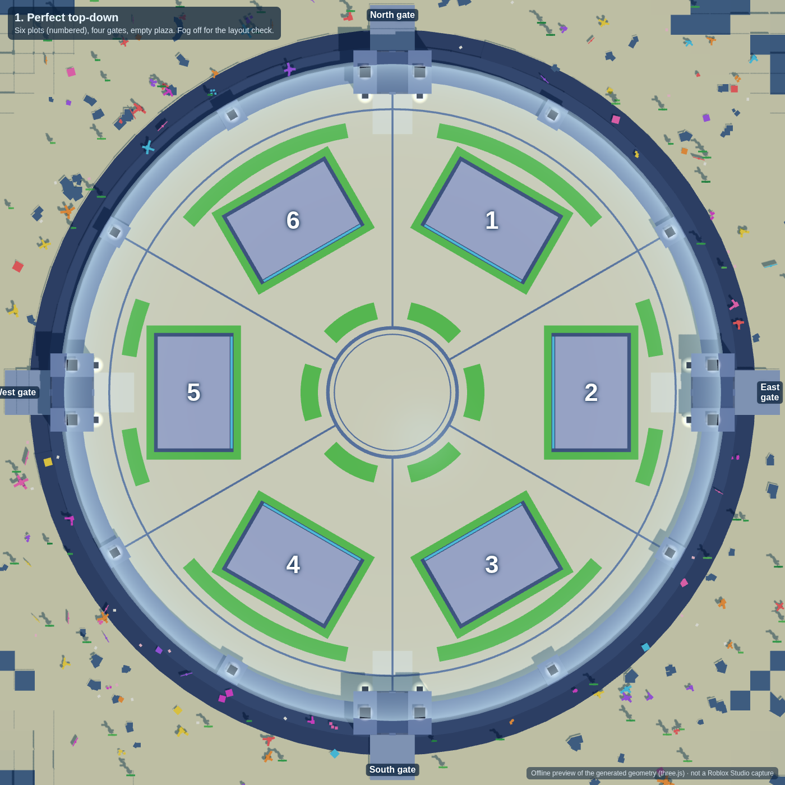
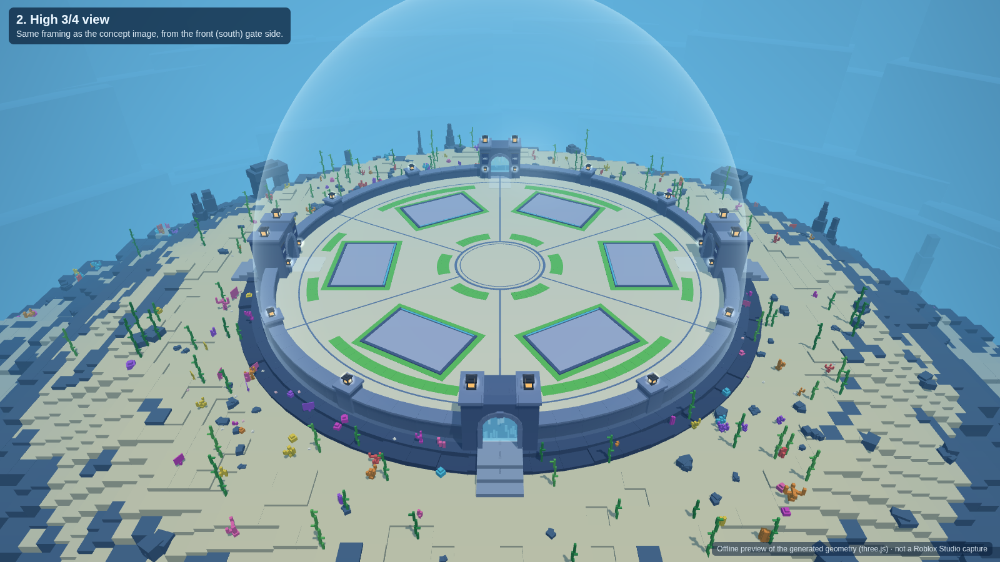
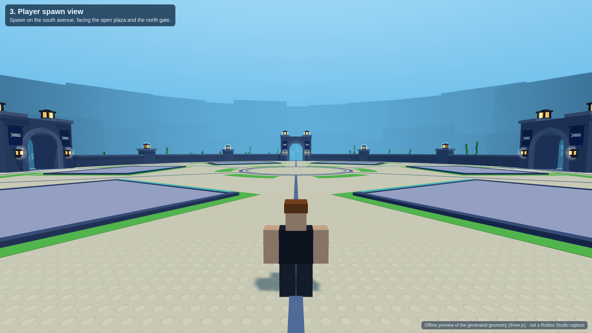
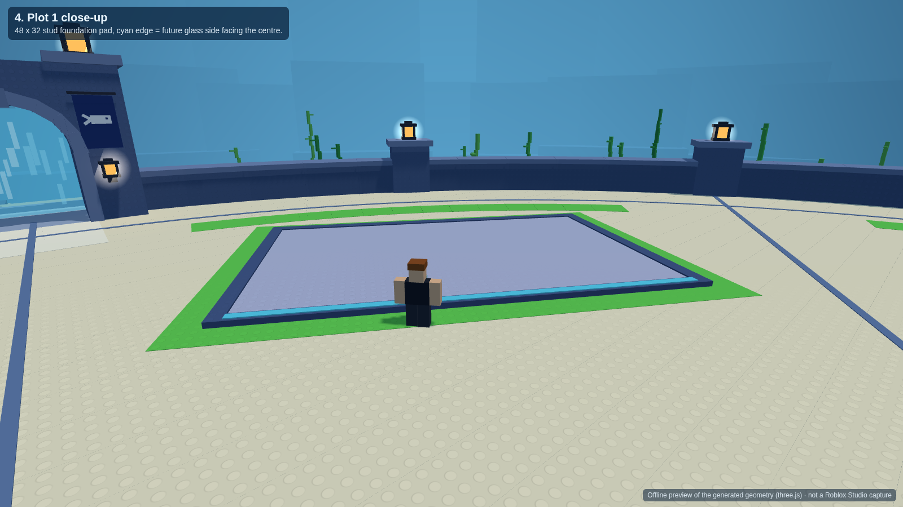
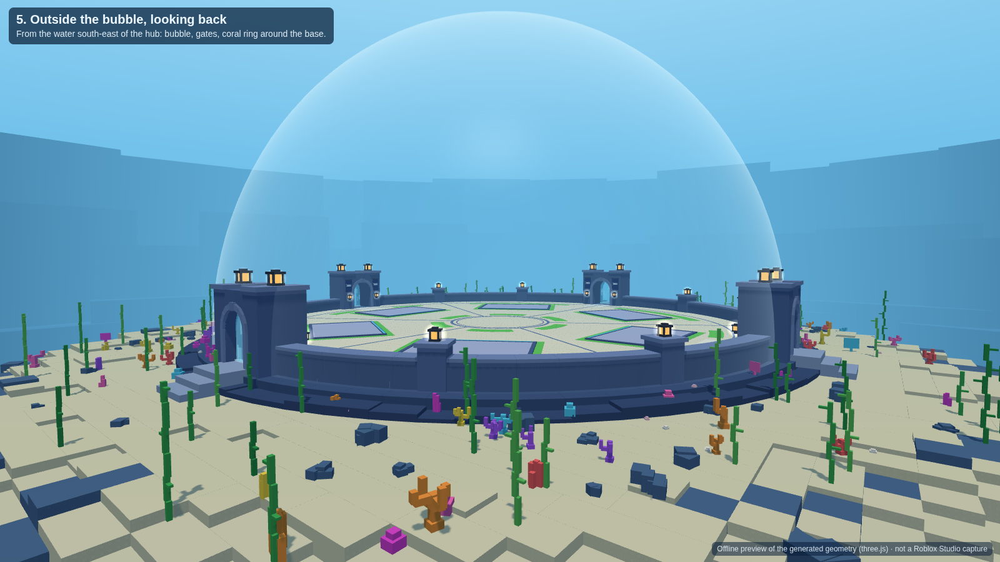
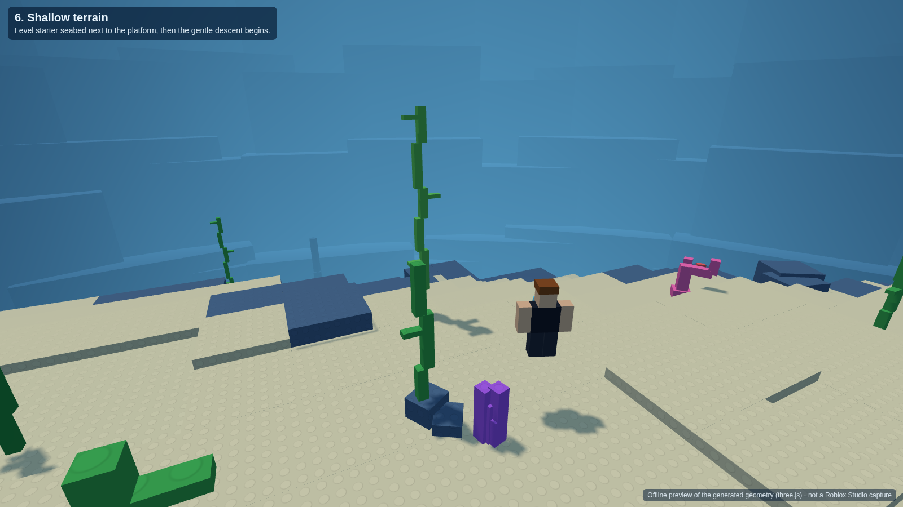
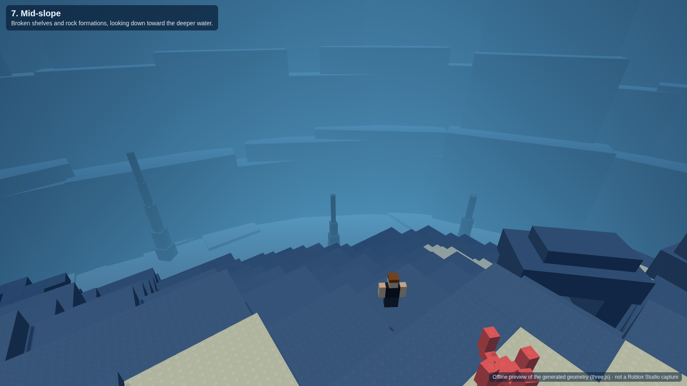
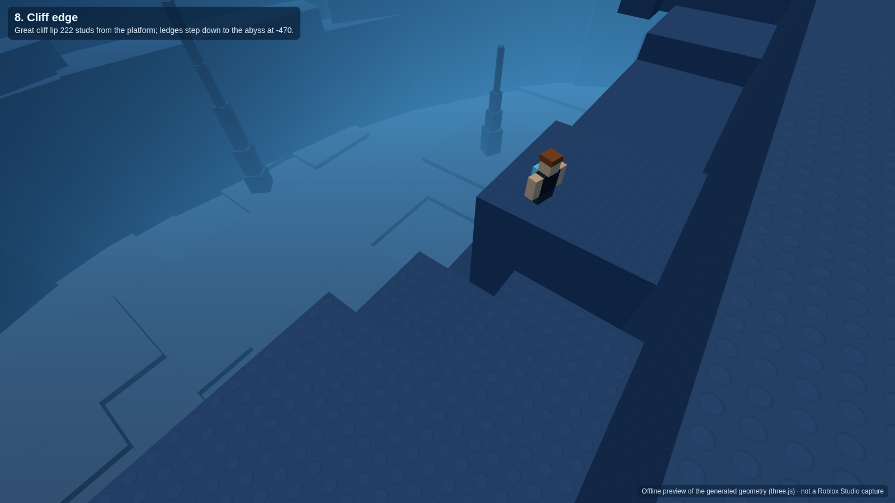
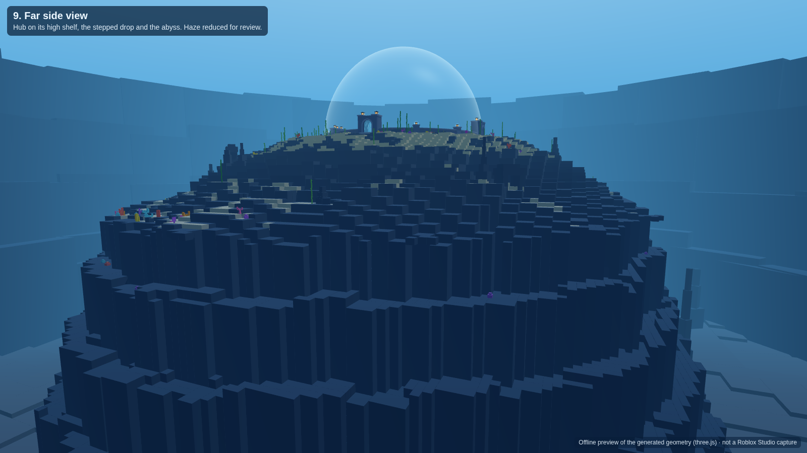

# Dive for Eggs: starter hub revision

This pass covers the final base layout, six player plazas and the terrain depth pass. It is environment and layout only. It adds no aquariums, shops, props or gameplay systems.

Everything is generated by Luau code, so the layout can be rebuilt and retuned from one config module ([`Config.luau`](src/ReplicatedStorage/DiveWorld/Config.luau)).

## Install into your place (Roblox Studio)

**Quickest: one paste.**

1. Open your place in Studio and turn on **View → Command Bar**.
2. Open [`studio/DiveWorldInstaller.luau`](studio/DiveWorldInstaller.luau), copy the whole file, paste it into the command bar and press Enter.
3. The Output window prints `[DiveWorld] Installed scripts and built Workspace.DiveStarterWorld`.

If the command bar struggles with the 78 KB paste:

1. Insert a `ModuleScript` into ServerStorage.
2. Paste the file into it.
3. Run `require(game.ServerStorage.ModuleScript)` in the command bar, then delete the ModuleScript.

**Rojo:** `rojo serve` with [`default.project.json`](default.project.json). Then bake the world once from the command bar:
`require(game.ServerScriptService.DiveWorldBuild.WorldBuilder).build()`

Re-running either path replaces the scripts and rebuilds `Workspace.DiveStarterWorld`. If the world is not baked, the server script builds it at server start instead. Spawning is held back until the floor exists.

### What the build touches

| Thing | Change |
| --- | --- |
| `Workspace.DiveStarterWorld` | Hub, bubble, seabed and decor. Replaced on every build. |
| `Workspace.Terrain` | Filled with water over ±1152 studs (X/Z) from y −496 to 220, with a dry air pocket carved under the bubble. Any terrain already in that region is overwritten. |
| `Lighting` | Base values set. The existing `Atmosphere` is replaced by `DiveAtmosphere`. `DiveColorCorrection` and `DiveBloom` are added. |
| `Workspace.FallenPartsDestroyHeight` | Lowered to −596 when built from the command bar. The abyss floor sits at −470, just above Roblox's default −500. |
| Scripts | `ReplicatedStorage.DiveWorld`, `ServerScriptService.DiveWorldBuild`, `StarterPlayerScripts.DiveWorldClient` |

**Delete the previous 8-plot hub model before building.** This code cannot know its name.

If your place already has a neutral-buoyancy script, keep one of the two.

## What was built

### Hub (dry, inside the bubble)

- **Floor:** solid studded cream floor, wall to wall, with no hole. Floor top is y = 0.
- **Central plaza:** 52-stud diameter, completely empty. It has only a flush double trim ring.
- **Six sectors:** exactly six equal 60° sectors with six thin radial dividers.
  - Plot axes sit at 30°, 90°, 150°, 210°, 270° and 330°, matching the concept image.
  - The north and south gates open onto divider avenues.
  - The east and west gates sit behind plots 2 and 5.
- **Six aquarium foundation pads:** 48 × 32 studs (1.5 : 1).
  - Width runs along the circumference and depth runs radially.
  - Each pad's glass side (LookVector) faces the centre, shown by a cyan edge line.
  - Each plot has an invisible `AquariumAnchor` part carrying a `PlotId` attribute, for future aquarium placement.
- **Floor colour mix:** measured on the open floor as 81% cream, 15% green and 4% trim.
  - Green is used as pad margins, a small arc in front of each plot and a curved strip behind it.
- **Interior props:** none. Nothing inside the walls rises more than 1 stud above the floor apart from the walls and gates.
- **Lanterns:** only on the wall pillars (every 30°) and paired at each gate.
- **Gates:** four waterfall gates at north, east, south and west.
  - Each has a stepped stone arch and a see-through cyan water curtain on the bubble line. Falling streaks are animated on the client.
  - Each has warm lanterns and a fish banner, and a threshold that steps down to the seabed.
  - The hub side is air and the ocean side is terrain water. Walking through switches straight into swimming, with no teleport.
- **Bubble:** one smooth ellipsoid shell, 134 radius and 150 tall, 88% transparent. It has no ribs or panels.
- **Spawn:** on the south avenue, 100 studs out, facing the plaza.

### Terrain (studded Roblox blocks)

Distances are measured from the platform edge, which is 146 studs from the centre.

| Distance | Terrain | Height |
| --- | --- | --- |
| 0–40 | Level starter sand, beginner coral, kelp, small rocks | −6 (±1 at the outer edge) |
| 40–100 | Gentle slope, raised/lowered sand shelves, larger rocks | −6 → about −30 |
| 100–180 | Broken shelves, small cliffs, rock pinnacles, swim-through arches | −30 → about −85 |
| 180 → lip | Cliff approach, coral along the lip | about −85 → −115 |
| lip (209–281, closest to the south) | Great cliff | See below |
| beyond | Abyss floor with dark spires | −470 |

- **Great cliff:** four ragged ledges at −165, −235, −310 and −390, then a scree face down to the abyss at −470.
  - It includes caves, overhangs and cracks.
  - The tallest single face is 88 studs, so it steps down rather than dropping as one wall.
- **Basin rim:** the world closes with a continuous ring of stepped cliffs about 1,040 studs out, deep in the haze. It breaks the water surface.
- **Colours:** sand and rock blend with height from warm sand and blue-grey (RGB 225-215-180 and 75-105-140) down to navy (30-55-90).
- **Lighting by depth:** [`DepthLighting`](src/StarterPlayer/StarterPlayerScripts/DiveWorldClient/DepthLighting.client.luau) blends the ambient light, haze, tint and water colour with camera depth. The hub stays bright; the deep water turns navy but never black.
- **Neutral buoyancy:** [`NeutralBuoyancy`](src/StarterPlayer/StarterPlayerScripts/DiveWorldClient/NeutralBuoyancy.client.luau) holds vertical velocity at 0 while a player swims with no input. It lets go as soon as there is movement or jump input.

About 8,100 parts in total: hub 1,289, seabed 4,890, decor 1,917.

## Review screenshots

These are offline renders of the exact geometry the code generates, made with three.js from the builder output. **They are not Roblox Studio captures.** Studs, materials, water and lighting are approximations. Please capture the same nine views in Studio for final sign-off.

| | |
| --- | --- |
|  |  |
|  |  |
|  |  |
|  |  |
|  | |

## Acceptance checks

`lune run tools/check-world.luau` builds the world with the real modules against a small mock of the Roblox API. It then checks the review checklist on the resulting geometry:

- Exactly 6 plots, 6 pads and 6 dividers.
- Pads are 1.5 : 1, run along the circumference, face inward and are spaced 60° apart. No square pads remain.
- The plaza is empty, with no interior clutter and no lanterns inside.
- There are no statue, fountain, bridge, ladder or support parts, and no aquariums.
- The floor is solid (12,361 samples) and the cream/green ratio is as listed above.
- Four gates sit at 0/90/180/270 with see-through, non-colliding curtains on the bubble line and clear openings.
- There is one transparent bubble. The ocean is filled with water and the hub is carved dry.
- The spawn faces the centre.
- Terrain is level for 40 studs and gets deeper band by band. It reaches the abyss in all 72 directions and steps through 3+ ledges in all of them.
- The tallest single cliff face is 88 studs, and the cliff has caves and overhangs.
- There is no giant boundary wall, and the rim is continuous above the surface.
- Terrain is studded plastic, and the neutral buoyancy script holds vertical velocity at 0.

All checks pass.

## Tools

Needs [Lune](https://github.com/lune-org/lune) (`cargo install lune`) and, for renders, Node 18+.

```bash
lune run tools/check-world.luau        # acceptance checks
lune run tools/bundle-studio.luau      # regenerate studio/DiveWorldInstaller.luau after editing src/
lune run tools/check-installer.luau    # run the installer against the mock
lune run tools/export-scene.luau       # scene JSON for the preview
cd tools/preview && npm install && node render.mjs   # screenshots/ (CHROMIUM_PATH=... to use a local Chromium)
stylua src tools                       # formatting
```

## Not verified here

This was built without access to Roblox Studio. The mock checks prove the geometry, not how Roblox renders or simulates it. Please check these in Studio:

- Stud surfaces and the Glass curtains render as expected.
- The terrain-water boundary at each gate switches cleanly between walking and swimming.
- The neutral-buoyancy force feels right, and it doesn't fight any existing custom swim controls.
- The haze and depth values in `Config.DepthLighting` are starting values to tune by eye.
