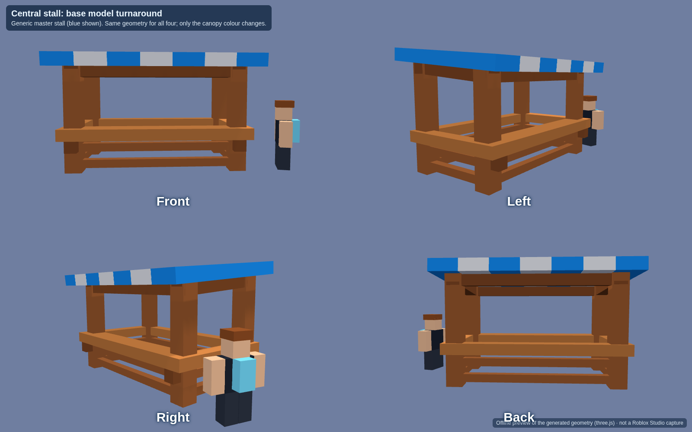
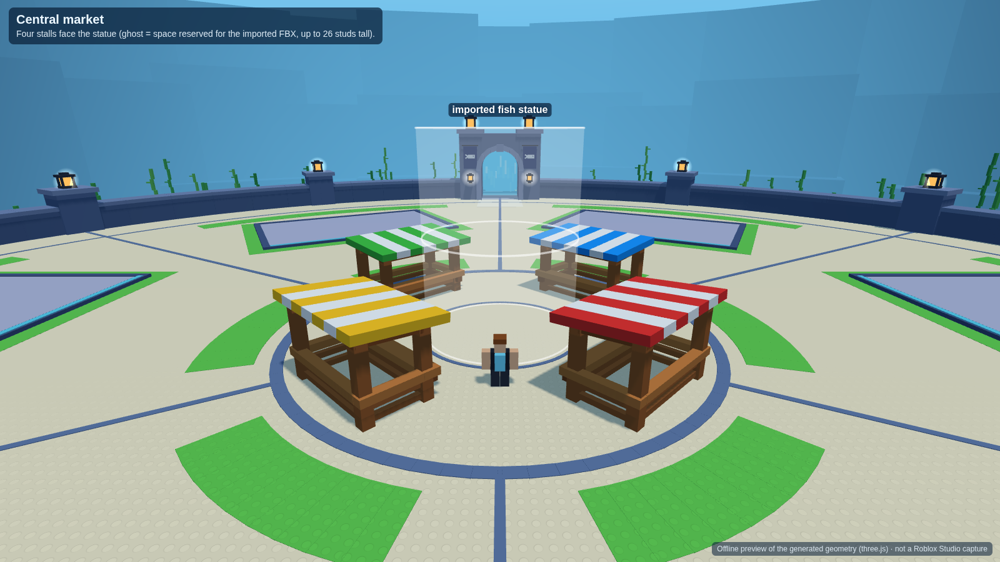

# Dive for Eggs: starter hub

The starter hub is built in two passes:

1. **Base layout:** six player plazas and the terrain depth pass.
2. **Central market:** four generic stalls facing the centre, and the imported fish statue installed with lit lanterns. See [Central market and fish statue](#central-market-and-fish-statue).

Both passes are environment only. They add no shops, prompts, vendors or gameplay systems.

Everything is generated by Luau code, so the layout can be rebuilt and retuned from one config module ([`Config.luau`](src/ReplicatedStorage/DiveWorld/Config.luau)).

## Install into your place (Roblox Studio)

**Quickest: one paste.**

1. Open your place in Studio and turn on **View → Command Bar**.
2. Open [`studio/DiveWorldInstaller.luau`](studio/DiveWorldInstaller.luau), copy the whole file, paste it into the command bar and press Enter.
3. The Output window prints `[DiveWorld] Installed scripts and built Workspace.DiveStarterWorld`.

If the command bar struggles with the 117 KB paste:

1. Insert a `ModuleScript` into ServerStorage.
2. Paste the file into it.
3. Run `require(game.ServerStorage.ModuleScript)` in the command bar, then delete the ModuleScript.

**Rojo:** `rojo serve` with [`default.project.json`](default.project.json). Then bake the world once from the command bar:
`require(game.ServerScriptService.DiveWorldBuild.WorldBuilder).build()`

Re-running either path replaces the scripts and rebuilds `Workspace.DiveStarterWorld`. If the world is not baked, the server script builds it at server start instead. Spawning is held back until the floor exists.

### What the build touches

| Thing | Change |
| --- | --- |
| `Workspace.DiveStarterWorld` | Hub, bubble, seabed and decor. Replaced on every build, except `Hub.CentralPlaza`, which holds the imported statue and is carried over untouched. |
| `ServerStorage.DiveWorldTemplates` | `CentralStall_Master`, the stall all four stalls are cloned from. |
| `Workspace.Terrain` | Filled with water over ±1152 studs (X/Z) from y −496 to 220, with a dry air pocket carved under the bubble. Any terrain already in that region is overwritten. |
| `Lighting` | Base values set. The existing `Atmosphere` is replaced by `DiveAtmosphere`. `DiveColorCorrection` and `DiveBloom` are added. |
| `Workspace.FallenPartsDestroyHeight` | Lowered to −596 when built from the command bar. The abyss floor sits at −470, just above Roblox's default −500. |
| Scripts | `ReplicatedStorage.DiveWorld`, `ServerScriptService.DiveWorldBuild`, `StarterPlayerScripts.DiveWorldClient` |

**Delete the previous 8-plot hub model before building.** This code cannot know its name.

If your place already has a neutral-buoyancy script, keep one of the two.

## What was built

### Hub (dry, inside the bubble)

- **Floor:** solid studded cream floor, wall to wall, with no hole. Floor top is y = 0.
- **Central plaza:** 55-stud diameter. The four stalls stand on it, around a statue zone of 9.8-stud radius marked by a thin trim ring. The statue zone stays empty until you install the imported statue.
- **Six sectors:** exactly six equal 60° sectors with six thin radial dividers.
  - Plot axes sit at 30°, 90°, 150°, 210°, 270° and 330°, matching the concept image.
  - The north and south gates open onto divider avenues.
  - The east and west gates sit behind plots 2 and 5.
- **Six aquarium foundation pads:** 48 × 32 studs (1.5 : 1).
  - Width runs along the circumference and depth runs radially.
  - Each pad's glass side (LookVector) faces the centre, shown by a cyan edge line.
  - Each plot has an invisible `AquariumAnchor` part carrying a `PlotId` attribute, for future aquarium placement.
- **Floor colour mix:** measured on the open floor as 81% cream, 15% green and 4% trim.
  - Green is used as pad margins, a small arc in front of each plot and a curved strip behind it.
- **Interior props:** none apart from the four central stalls. Nothing else inside the walls rises more than 1 stud above the floor, except the walls and gates.
- **Lanterns:** only on the wall pillars (every 30°) and paired at each gate.
- **Gates:** four waterfall gates at north, east, south and west.
  - Each has a stepped stone arch and a see-through cyan water curtain on the bubble line. Falling streaks are animated on the client.
  - Each has warm lanterns and a fish banner, and a threshold that steps down to the seabed.
  - The hub side is air and the ocean side is terrain water. Walking through switches straight into swimming, with no teleport.
- **Bubble:** one smooth ellipsoid shell, 134 radius and 150 tall, 88% transparent. It has no ribs or panels.
- **Spawn:** on the south avenue, 100 studs out, facing the central market.

### Terrain (studded Roblox blocks)

Distances are measured from the platform edge, which is 146 studs from the centre.

| Distance | Terrain | Height |
| --- | --- | --- |
| 0–40 | Level starter sand, beginner coral, kelp, small rocks | −6 (±1 at the outer edge) |
| 40–100 | Gentle slope, raised/lowered sand shelves, larger rocks | −6 → about −30 |
| 100–180 | Broken shelves, small cliffs, rock pinnacles, swim-through arches | −30 → about −85 |
| 180 → lip | Cliff approach, coral along the lip | about −85 → −115 |
| lip (209–281, closest to the south) | Great cliff | See below |
| beyond | Abyss floor with dark spires | −470 |

- **Great cliff:** four ragged ledges at −165, −235, −310 and −390, then a scree face down to the abyss at −470.
  - It includes caves, overhangs and cracks.
  - The tallest single face is 88 studs, so it steps down rather than dropping as one wall.
- **Basin rim:** the world closes with a continuous ring of stepped cliffs about 1,040 studs out, deep in the haze. It breaks the water surface.
- **Colours:** sand and rock blend with height from warm sand and blue-grey (RGB 225-215-180 and 75-105-140) down to navy (30-55-90).
- **Lighting by depth:** [`DepthLighting`](src/StarterPlayer/StarterPlayerScripts/DiveWorldClient/DepthLighting.client.luau) blends the ambient light, haze, tint and water colour with camera depth. The hub stays bright; the deep water turns navy but never black.
- **Neutral buoyancy:** [`NeutralBuoyancy`](src/StarterPlayer/StarterPlayerScripts/DiveWorldClient/NeutralBuoyancy.client.luau) holds vertical velocity at 0 while a player swims with no input. It lets go as soon as there is movement or jump input.

About 8,200 parts in total: hub 1,405 (including 116 for the stalls), seabed 4,890, decor 1,917.

## Central market and fish statue

### The four stalls

The stalls are modelled on the stall reference turnaround, with all sonar content removed. There is no header, sign, logo, products or hanging screen.

- **Shape:** four chunky posts, top beams, a canopy sloping 5° toward the front, a thick counter and two rows of lower rails.
  - The canopy has seven stripes running front to back.
  - The counter sticks out 0.7 studs past the front posts and wraps around the sides and back.
- **Size:** 14.2 studs wide and 8 deep between the posts. The canopy is 16.3 wide, and the roof top is about 10 studs up.
  - The counter top is at 3.5 studs, about chest height on a 5-stud avatar.
- **Master and copies:** one master is built as `ServerStorage.DiveWorldTemplates.CentralStall_Master`. Four exact clones sit in `DiveStarterWorld.Hub.CentralStalls`: `CentralStall_Blue`, `CentralStall_Red`, `CentralStall_Yellow` and `CentralStall_Green`.
  - Each clone contains `Frame`, `Roof`, `Counter` and `LowerSupports`.
  - Only the coloured canopy stripes differ between them. The wood is the same warm brown on all four.
- **Placement:** on the plaza diagonals (45°, 135°, 225° and 315°), 20.5 studs from the centre, with every counter facing the statue.
  - Straight lanes from the statue to all four ocean gates stay open.
  - The stalls stay inside the plaza ring, clear of the radial floor lines, and leave a 6-stud walking ring around the statue zone.
- **Edit mode:** the stalls are real parts that exist in edit mode, so you can select, move and edit them in Studio.




### Installing the imported fish statue

The statue is your imported FBX and only exists in your place. It is fitted by [`CentralPlazaUpdate`](src/ServerScriptService/DiveWorldBuild/CentralPlazaUpdate.luau), which you run in Studio:

1. In **Explorer**, click the **new** imported statue model so it is selected.
2. Run [`studio/CentralPlazaUpdate.luau`](studio/CentralPlazaUpdate.luau) the same way as the installer: paste it into the command bar, or into a ModuleScript and `require` it.
3. Read the `[CentralPlaza]` lines in Output. They say what was found, moved, scaled and lit.

What it does:

- **Refuses rather than guesses.** It changes nothing if nothing is selected, if more than one object is selected, or if the selection doesn't look like an import. An import has MeshParts, no scripts, and at most 300 parts.
- **Moves, never deletes.** These go to `ServerStorage.DiveBackup`:
  - the old centrepiece: anything standing in the plaza, including fish, pedestal, coral, lights and invisible collision
  - old stalls near the plaza
  - duplicate copies of the same import
  - Spawn locations, aquariums, gates and the bubble are never moved. The whole run is one undo step (Ctrl+Z).
- **Organises the import** as a single Model, `DiveStarterWorld.Hub.CentralPlaza.FishStatue`. Its textures, MeshIds and SurfaceAppearances are left as they are.
- **Anchors every part** and turns off collision on the art. It adds one invisible `StatueCollision` cylinder, 10 studs tall, around the base so players walk around it smoothly.
- **Scales uniformly** to 26 studs tall, unless the statue is too wide for its 9.8-stud zone, in which case it is scaled to fit that instead. Proportions are never changed.
- **Centres the base** on the plaza (0, 0) and rests it on the floor.
- **Turning:** the model is only turned if you set `Config.Statue.YAW_DEGREES`, for example 90 or 180, and run again. You can also rotate `FishStatue` with Studio's rotate tool.
- **Lights the lanterns that are part of the model.** It adds one soft warm `PointLight` per lantern: brightness 1, range 9, no shadows. It finds the lanterns in this order:
  1. `LanternMarker` parts you placed by hand.
  2. Separate glow parts: named glow, bulb, flame or emissive, or small warm-coloured untextured parts low on the statue. These are also set to warm Neon, and only the glow piece, not the lantern frame.
  3. Parts named lantern, lamp, torch or candle (light only).
  4. Warm lantern glass painted into the statue's texture. This reads the mesh and texture with Roblox's EditableMesh and EditableImage APIs, and keeps only warm spots on a ring low around the base.
- **If no lanterns are found:** put a small Part named `LanternMarker` inside `FishStatue` at each lantern and run again.
- **Re-running:** run `require(game.ServerScriptService.DiveWorldBuild.CentralPlazaUpdate).run()` with nothing selected. It refits the existing `FishStatue` without adding anything twice.

## Review screenshots

These are offline renders of the exact geometry the code generates, made with three.js from the builder output. **They are not Roblox Studio captures.** Studs, materials, water and lighting are approximations. The imported statue can't appear in them, because it only exists in your place. Please capture the same views in Studio for final sign-off.

| | |
| --- | --- |
|  |  |
|  |  |
|  |  |
|  |  |
|  | |

## Acceptance checks

`lune run tools/check-world.luau` builds the world with the real modules against a small mock of the Roblox API. It then checks the review checklist on the resulting geometry:

- Exactly 6 plots, 6 pads and 6 dividers.
- Pads are 1.5 : 1, run along the circumference, face inward and are spaced 60° apart. No square pads remain.
- The statue zone is clear. The only interior objects are the four stalls, and there are no lanterns inside.
- Stalls: exactly four (blue, red, yellow, green) and exact copies of the master; only the canopy colour differs.
  - They have no text or products, and every counter faces the centre, 90° apart.
  - They don't overlap each other, stay inside the plaza ring, and leave the 6-stud walking ring and the four gate lanes open.
  - Their scale fits a 5-stud avatar.
- There are no fountain, bridge, ladder, bench, sign or sonar parts, and no aquariums.
- The floor is solid (12,361 samples) and the cream/green ratio is as listed above.
- Four gates sit at 0/90/180/270 with see-through, non-colliding curtains on the bubble line and clear openings.
- There is one transparent bubble. The ocean is filled with water and the hub is carved dry.
- The spawn faces the centre.
- Terrain is level for 40 studs and gets deeper band by band. It reaches the abyss in all 72 directions and steps through 3+ ledges in all of them.
- The tallest single cliff face is 88 studs, and the cliff has caves and overhangs.
- There is no giant boundary wall, and the rim is continuous above the surface.
- Terrain is studded plastic, and the neutral buoyancy script holds vertical velocity at 0.

`lune run tools/check-plaza-update.luau` runs the statue tool against a fake old statue, old sonar stall, loose coral, fake import with six lanterns, and a duplicate import. It checks that:

- selecting the whole hub is refused
- the old statue, stall, coral and duplicate are moved to the backup, and the spawn is left alone
- the statue is organised, anchored, centred on the floor and uniformly scaled inside its zone
- there is one collision cylinder
- the six lanterns get a neon glow panel and a PointLight each, with frames untouched
- re-running adds nothing twice, and a full world rebuild keeps the statue

All checks pass.

## Tools

Needs [Lune](https://github.com/lune-org/lune) (`cargo install lune`) and, for renders, Node 18+.

```bash
lune run tools/check-world.luau        # acceptance checks
lune run tools/bundle-studio.luau      # regenerate studio/*.luau after editing src/
lune run tools/check-plaza-update.luau # statue tool checks
lune run tools/check-installer.luau    # run both studio/ files against the mock
lune run tools/export-scene.luau       # scene JSON for the preview
cd tools/preview && npm install && node render.mjs   # screenshots/ (CHROMIUM_PATH=... to use a local Chromium)
stylua src tools                       # formatting
```

## Not verified here

This was built without access to Roblox Studio. The mock checks prove the geometry, not how Roblox renders or simulates it. Please check these in Studio:

- Stud surfaces and the Glass curtains render as expected.
- The terrain-water boundary at each gate switches cleanly between walking and swimming.
- The neutral-buoyancy force feels right, and it doesn't fight any existing custom swim controls.
- The haze and depth values in `Config.DepthLighting` are starting values to tune by eye.
- **Statue tool:** the EditableMesh and EditableImage paths, which read the exact mesh shape and find lanterns painted into the texture, can't run offline.
  - If Studio refuses them, the tool falls back to part bounding boxes and part names or colours, and says so in Output.
  - Check the lantern count and placement it reports.
- **Statue orientation:** which side of the statue faces the spawn can't be detected. Set `Config.Statue.YAW_DEGREES` or rotate the model if the big fish faces the wrong way.
